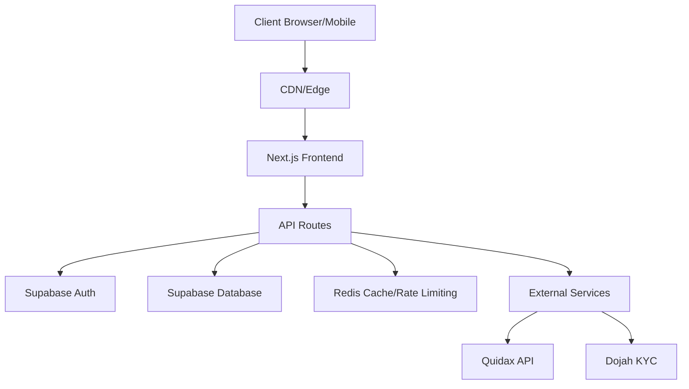
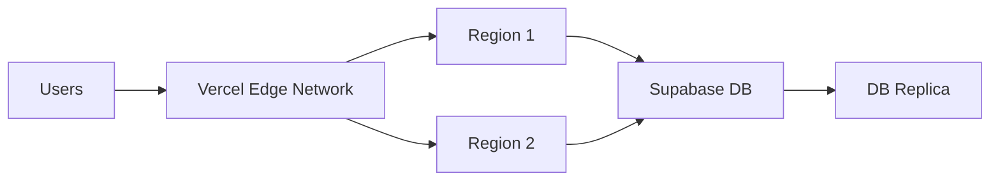
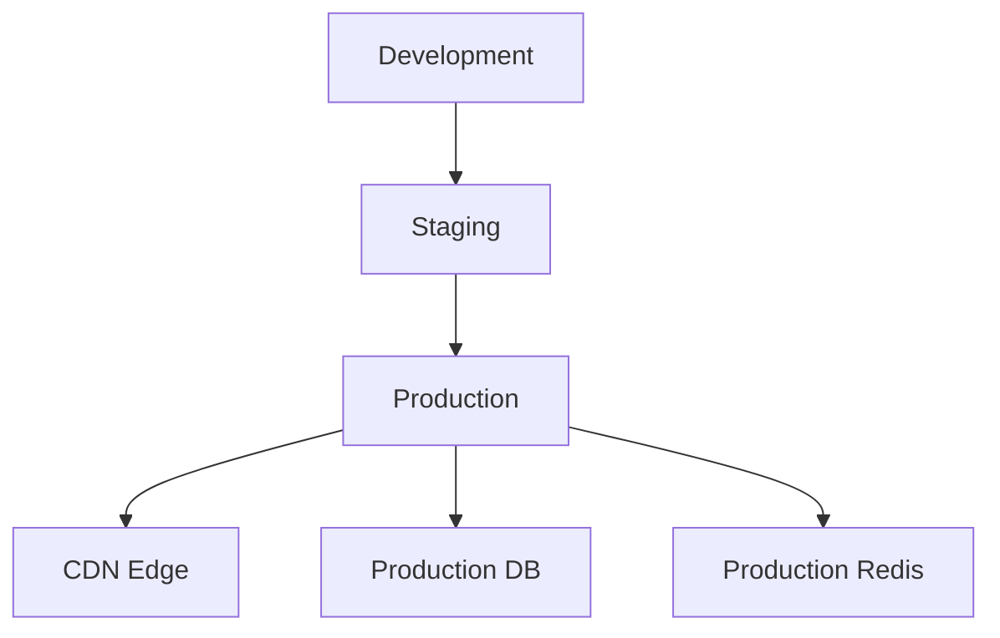

# Technical Architecture

## Overview

TrustBank is built using a modern, scalable architecture with the following key components:

## Core Components

### Frontend (Next.js 14)

- **App Router**: Leverages React Server Components for optimal performance
- **TypeScript**: Ensures type safety across the application
- **TailwindCSS**: Utility-first CSS framework
- **shadcn/ui**: Reusable UI components
- **State Management**: React Context + Hooks

### Backend (Next.js API Routes)

- **API Routes**: Serverless functions for backend logic
- **Middleware**: Authentication, rate limiting, logging
- **Database Access**: Supabase client
- **External Integrations**: Quidax, Dojah

### Database (Supabase)

#### Tables
1. users
   - Authentication data
   - Profile information
   - KYC status

2. wallets
   - Multi-currency support
   - Balance tracking
   - Transaction history

3. transactions
   - Deposits/Withdrawals
   - P2P trades
   - Swap operations

4. kyc_records
   - Verification documents
   - Status tracking
   - Tier management

### Security

1. **Authentication**
   - Supabase Auth
   - JWT tokens
   - Session management

2. **2FA**
   - TOTP implementation
   - Backup codes
   - Rate limiting

3. **Data Protection**
   - Row Level Security (RLS)
   - Encrypted sensitive data
   - Input validation

## System Design

### High Availability

### Caching Strategy

1. **Edge Caching**
   - Static assets
   - API responses
   - Market data

2. **Redis Caching**
   - Rate limiting
   - Session data
   - Temporary storage

### Performance Optimization

1. **Frontend**
   - Code splitting
   - Image optimization
   - Static generation
   - Incremental Static Regeneration

2. **Backend**
   - Connection pooling
   - Query optimization
   - Batch operations

3. **Database**
   - Indexed queries
   - Materialized views
   - Efficient joins

## Scalability

### Horizontal Scaling

- Stateless API routes
- Distributed caching
- Load balancing

### Vertical Scaling

- Database optimization
- Resource allocation
- Performance monitoring

## Monitoring & Logging

### Metrics Collection

- Request latency
- Error rates
- Database performance
- Cache hit rates

### Logging

- Application logs
- Access logs
- Error tracking
- Audit trails

## Deployment Architecture

### CI/CD Pipeline

1. **Development**
   - Local development
   - Feature branches
   - Unit tests

2. **Staging**
   - Integration tests
   - Performance testing
   - Security scans

3. **Production**
   - Blue-green deployment
   - Automated rollbacks
   - Health checks

## External Services Integration

### Quidax Integration

- Market data
- Order execution
- Wallet operations

### Dojah Integration

- KYC verification
- Document validation
- Face matching

## Mobile Architecture

### React Native App

- Shared business logic
- Native UI components
- Offline support

### Mobile-Specific Features

- Biometric authentication
- Push notifications
- QR code scanning

## Future Considerations

1. **Scalability**
   - Microservices architecture
   - Event-driven design
   - Message queues

2. **Features**
   - Advanced trading features
   - Additional payment methods
   - Enhanced analytics

3. **Infrastructure**
   - Multi-region deployment
   - Disaster recovery
   - Automated scaling 